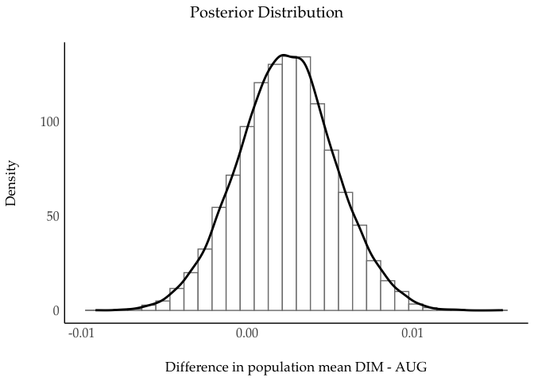

# README

Here we simulate the required sample size for a *Registered Study*,
where we draw the parameters (effect size, shape of the $\theta$,
within-participants design with a single factor) from the past study by
Lahdelma, Armitage & Eerola (2022). From this data, we only analyse
tetrads to keep the condition comparable condition to our registered study plan.

These are analysis operations and data for the study titled “Valenced
Priming with Acquired Affective Concepts in Music: Automatic Reactions
to Common Tonal Chords” by Imre Lahdelma and [Tuomas
Eerola](https://tuomaseerola.github.io/) in the journal of *Music
Perception*. Read this document at the [documentation
site](https://tuomaseerola.github.io/cultural_priming/).

# Sample size

Here is the link to the scripts and functions for
[planning](https://tuomaseerola.github.io/cultural_priming/planning.html)
the sample size for one sub-experiment.

# Data analysis

Four sub-experiments, all collected separately using psytoolkit.
Original data in zipped folder `raw_data.zip` and requires
`compile_data.R` script. For convenience we rely on the exported CSV
files per experiment.

## Load data

``` r
rm(list = ls())
library(ggplot2)
library(see)
library(dplyr)
library(ggdist)
library(tidybayes)
options(dplyr.summarise.inform = FALSE)

#### 2. Compile or load data ------------------------------------------
#source('compile_data.R')          # simply reading in the raw data and aggregating the background
source('load_data.R')             # reading in the data that has been filtered (exgaussian, practice trials)
```

    ## [1] "AUG: N=102"
    ## [1] "DIM: N=99"
    ## [1] "MIN: N=100"
    ## [1] "SUS: N=101"

## Describe participants

``` r
source('describe_participants.R')
d1 <- describe_participants(MIN)
```

    ## [1] "-----Age-------"
    ## [1] "Mean Age: 25.3"
    ## [1] "SD Age: 3.3"
    ## [1] "-----Musical Expertise (%)-------"
    ## 
    ##     Musician Non-musician 
    ##            4           96 
    ## [1] "-----Gender (%)-------"
    ## 
    ##  1  2  3  4  5 
    ## 49 46  2  1  2

``` r
d2 <- describe_participants(AUG)
```

    ## [1] "-----Age-------"
    ## [1] "Mean Age: 24.6"
    ## [1] "SD Age: 3.2"
    ## [1] "-----Musical Expertise (%)-------"
    ## 
    ##     Musician Non-musician 
    ##            9           91 
    ## [1] "-----Gender (%)-------"
    ## 
    ##  1  2  3  4  5  6 
    ## 48 47  1  1  1  2

``` r
d3 <- describe_participants(DIM)
```

    ## [1] "-----Age-------"
    ## [1] "Mean Age: 25.3"
    ## [1] "SD Age: 3.3"
    ## [1] "-----Musical Expertise (%)-------"
    ## 
    ##     Musician Non-musician 
    ##            3           97 
    ## [1] "-----Gender (%)-------"
    ## 
    ##  1  2  3 
    ## 42 57  1

``` r
d4 <- describe_participants(SUS)
```

    ## [1] "-----Age-------"
    ## [1] "Mean Age: 25.7"
    ## [1] "SD Age: 2.7"
    ## [1] "-----Musical Expertise (%)-------"
    ## 
    ##     Musician Non-musician 
    ##            6           94 
    ## [1] "-----Gender (%)-------"
    ## 
    ##  1  2  3  5 
    ## 50 49  1  1

``` r
source('background_across_substudies.R') # Compare backgrounds across the sub-experiments
```

    ## 
    ## AUG DIM MIN SUS 
    ## 102  99 100 101 
    ##              Df Sum Sq Mean Sq F value Pr(>F)
    ## study         3     57  19.140   1.952  0.121
    ## Residuals   398   3902   9.805               
    ## 
    ##  Pearson's Chi-squared test with simulated p-value (based on 2000
    ##  replicates)
    ## 
    ## data:  df$gender and df$study
    ## X-squared = 12.539, df = NA, p-value = 0.6967
    ## 
    ## 
    ##  Pearson's Chi-squared test with simulated p-value (based on 2000
    ##  replicates)
    ## 
    ## data:  df$study and df$MusExpertise
    ## X-squared = 3.8175, df = NA, p-value = 0.2759
    ## 
    ## [1] "across all sub-experiments"
    ## [1] "--------------------------"
    ## [1] "Age M: 25.22"
    ## [1] "Age SD: 3.14"
    ## [1] "Gender distr:"
    ## 
    ##           1           2           3           4           5           6 
    ## 0.472636816 0.495024876 0.012437811 0.004975124 0.009950249 0.004975124 
    ## [1] "MusExpertise distr:"
    ## 
    ##     Musician Non-musician 
    ##   0.05472637   0.94527363

# Visualise data

``` r
source('visualise.R')             # as to take in the block information

fig1 <- visualise(data = MIN,titletext='Major-Minor') 
fig2 <- visualise(data = AUG,titletext='Major-Augmented') 
fig3 <- visualise(data = DIM,titletext='Major-Diminished') 
fig4 <- visualise(data = SUS,titletext='Major-Suspended 4') 

G1<-see::plots(fig1[[1]], fig2[[1]], fig3[[1]], fig4[[1]], n_columns = 2, tags = FALSE,guides = "collect")

G2<-see::plots(fig1[[2]], fig2[[2]], fig3[[2]], fig4[[2]], n_columns = 2, tags = FALSE,guides = "collect")

print(G1)
```

<!-- -->

``` r
print(G2)
```

<!-- -->

## Save figures (Figure 1 and 2)

``` r
ggsave(filename = 'means.png',plot = G1, device = 'png',dpi = 300, width = 9.5, height = 7)
ggsave(filename = 'mean_and_raw_values.png',plot = G2, device = 'png',dpi = 300, width = 10.5, height = 7)
```

# Bayesian Analysis

``` r
source('calculate_bayes.R')   # function to calculate

# One sub-experiment takes about 20 mins to analyse, save results
b1 <- calculate_bayes(SUS)
save(b1,file = 'data/SUS_bayesR1.RData')
b1 <- calculate_bayes(MIN)
save(b1,file = 'data/MIN_bayesR1.RData')
b1 <- calculate_bayes(AUG)
save(b1,file = 'data/AUG_bayesR1.RData')
b1 <- calculate_bayes(DIM) # 18 min
save(b1,file = 'data/DIM_bayesR1.RData')
```

## Describe models

Check the model performance and the group-level effects (disabled for
now as the reporting is long).

``` r
load('data/MIN_bayesR1.RData')
summary(b1)
brms::ranef(b1)

load('data/AUG_bayesR1.RData')
summary(b1)
brms::ranef(b1)

load('data/DIM_bayesR1.RData')
summary(b1)
brms::ranef(b1)

load('data/SUS_bayesR1.RData')
summary(b1)
brms::ranef(b1)
```

## Report Bayesian evidence

Test directional hypothesis about congruence.

``` r
library(brms)

load('data/MIN_bayesR1.RData')
hyp_MIN <- brms::hypothesis(b1,"CongruenceN > 0",seed=1234,scope="standard",robust=TRUE)
load('data/AUG_bayesR1.RData')
hyp_AUG <- brms::hypothesis(b1,"CongruenceN > 0",seed=1234,scope="standard",robust=TRUE)
load('data/DIM_bayesR1.RData')
hyp_DIM <- brms::hypothesis(b1,"CongruenceN > 0",seed=1234,scope="standard",robust=TRUE)
load('data/SUS_bayesR1.RData')
hyp_SUS <- brms::hypothesis(b1,"CongruenceN > 0",seed=1234,scope="standard",robust=TRUE)
```

## Bayesian analysis summary table

Draw analysis results together as a table.

``` r
table2 <- rbind(hyp_MIN$hypothesis,hyp_AUG$hypothesis,hyp_DIM$hypothesis, hyp_SUS$hypothesis)
rownames(table2)<-c("Major-Minor","Major-Augmentd","Major-Diminished","Major-Suspended 4")
table2$Hypothesis<-'Congruence > 0'
knitr::kable(table2,digits = 4,caption='Summary of the analyses of each sub-experiment.')
```

|                   | Hypothesis      | Estimate | Est.Error | CI.Lower | CI.Upper | Evid.Ratio | Post.Prob | Star |
|:------------------|:----------------|---------:|----------:|---------:|---------:|-----------:|----------:|:-----|
| Major-Minor       | Congruence \> 0 |   0.0035 |    0.0020 |   0.0001 |   0.0069 |    20.6802 |    0.9539 | \*   |
| Major-Augmentd    | Congruence \> 0 |   0.0047 |    0.0020 |   0.0013 |   0.0080 |    79.8081 |    0.9876 | \*   |
| Major-Diminished  | Congruence \> 0 |   0.0070 |    0.0021 |   0.0036 |   0.0105 |  3999.0000 |    0.9998 | \*   |
| Major-Suspended 4 | Congruence \> 0 |   0.0026 |    0.0019 |  -0.0005 |   0.0057 |    11.1396 |    0.9176 |      |

Summary of the analyses of each sub-experiment.

## Plot posterior plots

``` r
library(extrafont)
library(latex2exp)

posterior_MIN <- hyp_MIN$samples
result_MIN <- bayestestR::hdi(posterior_MIN, ci = c(0.95))
p1 <- plot(result_MIN)+
  scale_fill_brewer(type = 'seq',palette = 'Greys',direction = -1)+
  see::theme_modern()+
  scale_x_continuous(limits = c(-0.005,0.015))+
  labs(title = TeX(r"(Major-Minor (Congruence $\theta$))"))+ 
   theme(text=element_text(size=16,  family="Palatino"))+
   theme(plot.title = element_text(hjust = 0.5))

posterior_AUG <- hyp_AUG$samples
result_AUG <- bayestestR::hdi(posterior_AUG, ci = c(0.95))
p2 <- plot(result_AUG)+
  scale_fill_brewer(type = 'seq',palette = 'Greys',direction = -1)+
  see::theme_modern()+
  scale_x_continuous(limits = c(-0.005,0.015))+
  labs(title = TeX(r"(Major-Augmented (Congruence $\theta$))"))+ 
   theme(text=element_text(size=16,  family="Palatino"))+
   theme(plot.title = element_text(hjust = 0.5))

posterior_DIM <- hyp_DIM$samples
result_DIM <- bayestestR::hdi(posterior_DIM, ci = c(0.95))
p3 <- plot(result_DIM)+
  scale_fill_brewer(type = 'seq',palette = 'Greys',direction = -1)+
  see::theme_modern()+
  scale_x_continuous(limits = c(-0.005,0.015))+
  labs(title = TeX(r"(Major-Diminished (Congruence $\theta$))"))+ 
   theme(text=element_text(size=16,  family="Palatino"))+
   theme(plot.title = element_text(hjust = 0.5))

posterior_SUS <- hyp_SUS$samples
result_SUS <- bayestestR::hdi(posterior_SUS, ci = c(0.95))
p4 <- plot(result_SUS)+
  scale_fill_brewer(type = 'seq',palette = 'Greys',direction = -1)+
  see::theme_modern()+
  scale_x_continuous(limits = c(-0.005,0.015))+
  labs(title = TeX(r"(Major-Suspended 4 (Congruence $\theta$))"))+ 
   theme(text=element_text(size=16,  family="Palatino"))+
   theme(plot.title = element_text(hjust = 0.5))

G<-see::plots(p1, p2, p3, p4, n_columns = 2, tags = FALSE,guides = "collect")
print(G)
```

<!-- -->

### Save figures

``` r
ggsave(filename = 'thetas.png',plot = G, device = 'png',dpi = 300,width = 9.5,height = 7)
```

## Mean marginal effects in milliseconds

``` r
library(emmeans)
load('data/MIN_bayesR1.RData')

draws <- b1 %>% 
  emmeans(~ CongruenceN,epred = TRUE) %>%
  contrast(method = "revpairwise") %>%
  gather_emmeans_draws()

draws %>% median_hdi()
```

    ## # A tibble: 1 × 7
    ##   contrast                       .value .lower .upper .width .point .interval
    ##   <chr>                           <dbl>  <dbl>  <dbl>  <dbl> <chr>  <chr>    
    ## 1 CongruenceN1 - (CongruenceN-1)   2.99 -0.431   6.43   0.95 median hdi

``` r
g1 <- ggplot(draws, aes(x = .value)) +
  stat_halfeye(fill = 'grey70') +
  labs(x = "Marginal effect of Congruence (ms)", y = "Density",title = 'Major-Minor') +
  see::theme_modern() +
  theme(legend.position = "bottom")+
  scale_x_continuous(limits = c(-3,12),breaks = seq(-3,12,by=3))+
  theme(text = element_text(size = 16,  family = "Palatino")) +
  theme(plot.title = element_text(hjust = 0.5))

load('data/AUG_bayesR1.RData')

draws <- b1 %>% 
  emmeans(~ CongruenceN,epred = TRUE) %>%
  contrast(method = "revpairwise") %>%
  gather_emmeans_draws()

draws %>% median_hdi()
```

    ## # A tibble: 1 × 7
    ##   contrast                       .value .lower .upper .width .point .interval
    ##   <chr>                           <dbl>  <dbl>  <dbl>  <dbl> <chr>  <chr>    
    ## 1 CongruenceN1 - (CongruenceN-1)   4.39  0.501   8.07   0.95 median hdi

``` r
g2 <- ggplot(draws, aes(x = .value)) +
  stat_halfeye(fill = 'grey70') +
  labs(x = "Marginal effect of Congruence (ms)", y = "Density",title = 'Major-Augmented') +
  see::theme_modern() +
  theme(legend.position = "bottom")+
  scale_x_continuous(limits = c(-3,12),breaks = seq(-3,12,by=3))+
  theme(text = element_text(size = 16,  family = "Palatino")) +
  theme(plot.title = element_text(hjust = 0.5))

load('data/DIM_bayesR1.RData')

draws <- b1 %>% 
  emmeans(~ CongruenceN,epred = TRUE) %>%
  contrast(method = "revpairwise") %>%
  gather_emmeans_draws()

draws %>% median_hdi()
```

    ## # A tibble: 1 × 7
    ##   contrast                       .value .lower .upper .width .point .interval
    ##   <chr>                           <dbl>  <dbl>  <dbl>  <dbl> <chr>  <chr>    
    ## 1 CongruenceN1 - (CongruenceN-1)   6.29   2.79   9.89   0.95 median hdi

``` r
g3 <- ggplot(draws, aes(x = .value)) +
  stat_halfeye(fill = 'grey70') +
  labs(x = "Marginal effect of Congruence (ms)", y = "Density",title = 'Major-Diminished') +
  see::theme_modern() +
  theme(legend.position = "bottom")+
  scale_x_continuous(limits = c(-3,12),breaks = seq(-3,12,by=3))+
  theme(text = element_text(size = 16,  family = "Palatino")) +
  theme(plot.title = element_text(hjust = 0.5))

load('data/SUS_bayesR1.RData')

draws <- b1 %>% 
  emmeans(~ CongruenceN,epred = TRUE) %>%
  contrast(method = "revpairwise") %>%
  gather_emmeans_draws()

draws %>% median_hdi()
```

    ## # A tibble: 1 × 7
    ##   contrast                       .value .lower .upper .width .point .interval
    ##   <chr>                           <dbl>  <dbl>  <dbl>  <dbl> <chr>  <chr>    
    ## 1 CongruenceN1 - (CongruenceN-1)   2.51  -1.12   6.04   0.95 median hdi

``` r
g4 <- ggplot(draws, aes(x = .value)) +
  stat_halfeye(fill = 'grey70') +
  labs(x = "Marginal effect of Congruence (ms)", y = "Density",title = 'Major-Suspended 4') +
  see::theme_modern() +
  theme(legend.position = "bottom")+
  scale_x_continuous(limits = c(-3,12),breaks = seq(-3,12,by=3))+
  theme(text = element_text(size = 16,  family = "Palatino")) +
  theme(plot.title = element_text(hjust = 0.5))


G3 <- see::plots(g1, g2, g3, g4, n_columns = 2, tags = FALSE,guides = "collect")
G3
```

<!-- -->

## Save figures

``` r
ggsave(filename = 'marginal_effects.png',plot = G3, device = 'png',dpi = 300,width = 9.5,height = 7)
```

# Compare the evidence between the sub-experiments

Does *Major–Diminished* chord pair provide significantly stronger
evidence than *Major–Augmented* pair using the posterior distributions?
How much?

## Mean difference between the sub-experiments

``` r
library(bayestestR)
posteriors <-
  data.frame(DIM = posterior_DIM$H1, AUG = posterior_AUG$H1) # join the posteriors of interest

# calculate the mean difference

posteriors = posteriors %>%
  mutate(mu_diff = DIM - AUG) # calculate difference

ggplot(posteriors, aes(mu_diff)) +
  geom_histogram(aes(y = ..density..),
                 color = "black",
                 fill = "white") +
  geom_density(linewidth = 1, color = "blue2") +
  xlab("Difference in population mean DIM - AUG") +
  labs(x = "Difference in population mean DIM - AUG", y='Density', title = "Posterior Distribution") +
  see::theme_modern() +
  theme(text = element_text(size = 16,  family = "Palatino")) +
  theme(plot.title = element_text(hjust = 0.5))
```

<!-- -->

``` r
quantile(posteriors$mu_diff, c(0.01, 0.10, 0.25, 0.50, 0.75, 0.90, 0.99))
```

    ##            1%           10%           25%           50%           75% 
    ## -0.0044358092 -0.0014222758  0.0004144141  0.0023701172  0.0043014859 
    ##           90%           99% 
    ##  0.0061098076  0.0092661480

``` r
sum(posteriors$mu_diff > 0) / length(posteriors$mu_diff) # 0.7937
```

    ## [1] 0.79375

``` r
d <- bayestestR::ci(posteriors$mu_diff,ci = 0.95)
d$CI_low
```

    ## [1] -0.003413847

``` r
d$CI_high
```

    ## [1] 0.008172973

There is a posterior probability of about 79 percent that the congruence
for DIM is greater than the mean congruence for AUG.

# Frequentist analysis

For a comparison (and for a comfort), let’s run linear mixed model (LMM)
with the same parameters (random factors) as defined in the Bayesian
model.

``` r
lmer_analysis <- function(data = NULL) {
  # lmer_analysis.R
  
  df <- data
  
  library(lme4)
  library(lmerTest)
  library(emmeans)
  library(nlme)
  options(contrasts = c("contr.sum", "contr.poly"))
  
  m0_lmm <-
    lmer(log(RT) ~ Congruence + (1 + Congruence |
                                   Id) + (1 | RandTransp) + (1 | Word),
         data = df)
  return <- summary(m0_lmm)
}
```

Run the model for each sub-experiment and summarise results.

``` r
lmm1 <- lmer_analysis(data = MIN) # 0.0854
lmm2 <- lmer_analysis(data = AUG) # 0.0273
lmm3 <- lmer_analysis(data = DIM) # 0.0007
lmm4 <- lmer_analysis(data = SUS) # 0.141

s1 <- summary(lmm1)
s2 <- summary(lmm2)
s3 <- summary(lmm3)
s4 <- summary(lmm4)

S <-
  rbind(s1$coefficients[2, ],
        s2$coefficients[2, ],
        s3$coefficients[2, ],
        s4$coefficients[2, ])
rownames(S) <-
  c('Major-Minor',
    'Major-Augmented',
    'Major-Diminished',
    'Major-Suspended 4')
knitr::kable(S, digits = 4)
```

|                   | Estimate | Std. Error |        df | t value | Pr(\>\|t\|) |
|:------------------|---------:|-----------:|----------:|--------:|------------:|
| Major-Minor       |  -0.0027 |     0.0016 | 4728.7636 | -1.7203 |      0.0854 |
| Major-Augmented   |  -0.0038 |     0.0017 |   86.8123 | -2.2452 |      0.0273 |
| Major-Diminished  |  -0.0056 |     0.0017 | 1926.6992 | -3.3853 |      0.0007 |
| Major-Suspended 4 |  -0.0024 |     0.0017 | 1844.7164 | -1.4736 |      0.1408 |
