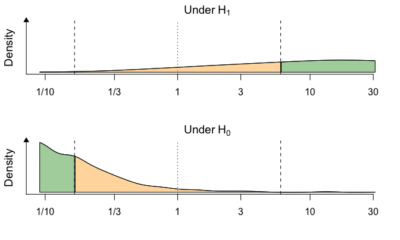
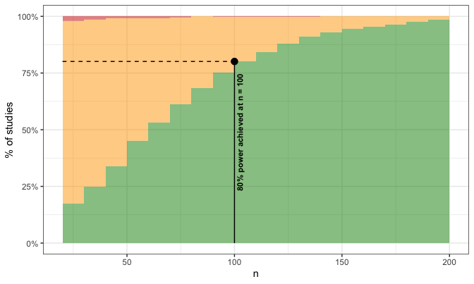
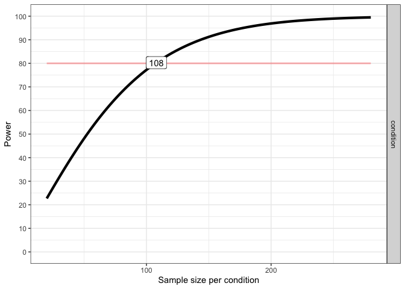

# Cultural Priming

Here we simulate the required sample size for a *Registered Study*,
where we draw the parameters (effect size, shape of the $\theta$,
within-participants design with a single factor) from the past study by
Lahdelma, Armitage & Eerola (2022). From this data, we only analyse
tetrads to keep the condition comparable condition to our registered study plan.

We offer two analyses of sample size and power, one **bayesian** and one **frequentist**, detailed below.

***

## Bayesian Simulation of Power and Sample Size

This simulations uses `BFDA` library by Schönbrodt & Stefan (2019).

``` r
library(BFDA)

set.seed(200)
  
sim.H1 <- BFDA.sim(expected.ES=0.35, type="t.paired",
                   prior=list("t", list(prior.location=0, prior.scale=sqrt(2)/2, prior.df=1)),
                   n.min=20, n.max=200, alternative="greater", boundary=Inf, B=1000,
                   verbose=FALSE, cores=8, stepsize = 10, design = 'sequential')

sim.H0 <- BFDA.sim(expected.ES=0.0, type="t.paired",
                   prior=list("t", list(prior.location=0, prior.scale=sqrt(2)/2, prior.df=1)),
                   n.min=20, n.max=200, alternative="greater", boundary=Inf, B=1000,
                   verbose=FALSE, cores=8, stepsize = 10, design = 'sequential')
```

### Results with the planned sample size (N = 100)

``` r
BFDA.analyze(sim.H1, design="fixed", n=100, boundary=6)
#> 80.1% showed evidence for H1 (BF > 6)
#> 19.7% were inconclusive (0.1667 < BF < 6)
#> 0.2% showed evidence for H0 (BF < 0.1667)
BFDA.analyze(sim.H0, design="fixed", n=100, boundary=6)
#> 0.4% showed evidence for H1 (BF > 6)
#> 31.7% were inconclusive (0.1667 < BF < 6)
#> 67.9% showed evidence for H0 (BF < 0.1667)
```

### Analysis to reach effective power (boundary >6)

``` r
BFDA.analyze(sim.H1, design="sequential", 
  n.min=20,
  n.max=150,
  boundary=6)
#>                                outcome percentage
#> 1 Studies terminating at n.max (n=150)       2.2%
#> 2    Studies terminating at a boundary      97.8%
#> 3       --> Terminating at H1 boundary      94.2%
#> 4       --> Terminating at H0 boundary       3.6%
#> 
#> Of 2.2% of studies terminating at n.max (n=150):
#> 1.1% showed evidence for H1 (BF > 3)
#> 1.1% were inconclusive (3 > BF > 1/3)
#> 0% showed evidence for H0 (BF < 1/3)
#> 
#> Average sample number (ASN) at stopping point (both boundary hits and n.max): n = 59
```

### Visualise the simulation results

``` r
evDens(BFDA.H1=sim.H1, 
  BFDA.H0=sim.H0,
  n=100,
  boundary=c(1/6, 6),
  xlim=c(1/11, 31))
```



### Sample size estimation

``` r
SSD(sim.H1, power=.80, boundary=c(1/6, 6))
#> Sample size determination for a fixed-n design:
#> ---------------------------------------
#> 
#> A >= 80% (actual: 80.1%) power achieved at n = 100
#> This setting implies long-term rates of:
#> 19.7% inconclusive results and
#>    0.2% false-negative results.
```




## Frequentist Simulation of Power and Sample Size

This simulation uses `Superpower` library by Lakens & Caldwell (2021).

``` r
library(Superpower)

# These are numbers for Musicae Scientiae data for tetrads only
congruent_M <- 580.3
congruent_SD <- 113.7
incongruent_M <- 593.9
incongruent_SD<- 111.1
SD <- (congruent_SD+incongruent_SD)/2

design_result <- ANOVA_design(design = "2w",
                              n = 100,
                              mu = c(congruent_M, incongruent_M),
                              sd = SD,
                              label_list = list("condition" = c("Congruent", "Incongruent")),
                              r <- c(0.90),
                              plot = FALSE)

power_result_vig_1 <- ANOVA_power(design_result, 
                                  alpha = 0.05, 
                                  nsims = 1000,
                                  seed = 1234) 
#> Power and Effect sizes for ANOVA tests
#>                 power effect_size
#> anova_condition  79.6     0.07869
#> 
#> Power and Effect sizes for pairwise comparisons (t-tests)
#>                                             power effect_size
#> p_condition_Congruent_condition_Incongruent  79.6      0.2782
#> 
#> 
#> Within-Subject Factors Included: Check MANOVA Results
print(confint(power_result_vig_1, level = .85))
#>                 power lower.ci upper.ci
#> anova_condition  79.6 76.99136  81.9821
```

### Sample size estimation

``` r
plot_power(design_result, min_n = 20, max_n = 280,desired_power = 80,liberal_lambda = TRUE)
```



    #> Achieved Power and Sample Size for ANOVA-level effects
    #>    variable                  label   n achieved_power desired_power
    #> 1 condition Desired Power Achieved 108           80.3            80


# References

* Schönbrodt, F. D. & Stefan, A. M. (2019). BFDA: An R package for Bayes factor
  design analysis (version 0.5.0) Retrieved from
  [https://github.com/nicebread/BFDA](https://github.com/nicebread/BFDA)

* Lahdelma, I., Armitage, J., & Eerola, T. (2022). Affective Priming With
Musical Chords is Influenced by Pitch Numerosity. *Musicae Scientiae,
26(1)*, 208–217. [https://doi.org/10.1177/1029864920911127](https://doi.org/10.1177/1029864920911127)

* Lakens, D. & Caldwell, A. (2021). Simulation-Based Power Analysis for Factorial Analysis of Variance Designs. _Advances in Methods and Practices in Psychological Science, 4(1)_, 251524592095150. [https://doi.org/10.1177/2515245920951503](https://doi.org/10.1177/2515245920951503)

